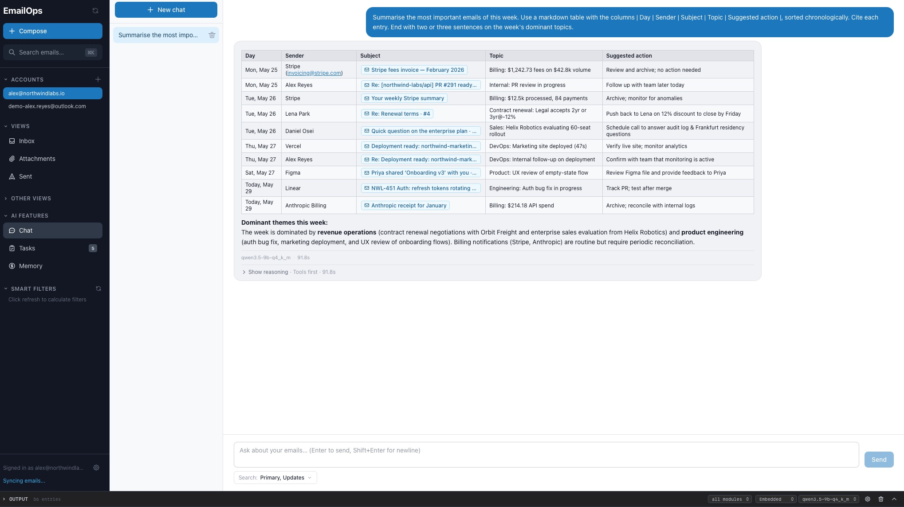

# EmailOps

[](LICENSE)

Privacy-first, Local AI-native desktop email client (currently Mac only).

## Screenshots



## Download

Download **macOS** releases from: [Releases page](https://github.com/emailops/emailops/releases/latest).

Windows and Linux releases are on the [roadmap](ROADMAP.md).

## Features

- **Multi-account email**: Gmail, Outlook / Microsoft 365 (Graph API), and IMAP/SMTP (iCloud, Yahoo, Fastmail, ProtonMail Bridge, custom servers)
- **Chat with your emails**: use AI to answer questions about your emails, generate drafts, ...
- **AI email classification**: auto-tag emails by priority, intent, and topic using configurable rules + local AI
- **Smart filters**: filter inbox by domain, sender, or classification tags
- **AI draft generation**: context-aware reply drafts using persona + thread history
- **Attachments view**: organize and access your attachments directly without searching in emails
- **AI provider abstraction**: embedded llama.cpp (default), local Ollama, or remote OpenRouter — switchable per feature

## Data + privacy model

- **Email content**: stored locally in SQLite in your OS app data directory.
- **OAuth tokens**: stored in the OS keychain via the Rust `keyring` crate (not in files).
- **AI**: by default runs in-process via the embedded **llama.cpp** runtime — no separate daemon, no network calls. Switching the provider to Ollama or OpenRouter is opt-in per feature.
- **Network**: external calls are limited to email provider APIs (Gmail, Microsoft Graph, IMAP/SMTP servers you configure) and — only if you've explicitly enabled it — the OpenRouter API.

## Troubleshooting

- **AI not available**: by default models run via embedded llama.cpp; make sure the recommended model has finished downloading from the in-app model manager. If you've switched the provider to Ollama, ensure the daemon is running and reachable at `http://localhost:11434`.
- **Semantic search returns keyword results**: generate embeddings from the in-app settings
- **Chat is slow:** depending on your machine and the model used this feature can take dozens of seconds. Try with a smaller model. We're working on making it faster

---

**The sections below are for developers building EmailOps from source.**

## Tech stack

- **Desktop**: Tauri 2.x
- **Backend**: Rust (Tokio, rusqlite, reqwest, oauth2, keyring)
- **Frontend**: React + TypeScript (Vite)
- **State**: Zustand
- **Styling**: Tailwind CSS
- **AI**: embedded **llama.cpp** runtime (default); optional Ollama (`http://localhost:11434`) or OpenRouter backends

## Prerequisites

- **Node.js** (recommended: latest LTS) + **npm**
- **Rust toolchain** (stable) + **Cargo**
- **Tauri system dependencies**
  - Follow the official Tauri prerequisites for your OS: `https://tauri.app/start/prerequisites/`
- **CMake** + a working C++ toolchain — required to build the embedded `llama-cpp-2` crate. On macOS, Xcode Command Line Tools cover this.
- **Ollama** is **optional**. Only install it if you want to route AI through Ollama instead of the embedded llama.cpp runtime:
  - Install Ollama: `https://ollama.com/`
  - Start the daemon and pull whichever models you plan to use, e.g.:

```bash
ollama pull llama3.2
ollama pull nomic-embed-text
```

## OAuth setup (required for Gmail / Outlook accounts)

1. **Gmail**: create OAuth credentials in [Google Cloud Console](https://console.cloud.google.com/apis/credentials) (type: **Desktop app**, enable Gmail API)
2. **Outlook / Microsoft 365**: register an application in the [Microsoft Entra admin center](https://entra.microsoft.com/) with the Graph API mail scopes (a public-client / desktop redirect)
3. **IMAP / SMTP** accounts don't need OAuth — add them directly from the in-app onboarding wizard.
4. Copy `.env.example` to `.env.local` in both the project root and `src-tauri/`:

    ```bash
    cp .env.example .env.local
    cp src-tauri/.env.example src-tauri/.env.local
    ```

5. Fill in your Gmail and/or Outlook credentials in both `.env.local` files.

## Running the app (dev)

Common workflows are wrapped in the top-level [`Makefile`](Makefile). The most useful targets:

```bash
make install     # npm install + lefthook install
make dev         # run Tauri against the repo-local dev data directory
make dev-fresh   # run against a throwaway data dir (safe for experiments)
make check       # lint + typecheck + clippy + Rust + frontend tests
make test        # cargo tests
make test-fast   # cargo tests with the embedded llama.cpp feature disabled (faster iteration)
make build       # production frontend build
make demo        # launch against a synthetic demo DB (auto-generated on first run)
```

`make dev` stores app data under an ignored repo-local directory by default.
Set `EMAILOPS_DATA_DIR=...` in `.env.local` when you need to point local
workflows at a different app data directory.

If you'd rather not use `make`:

```bash
npm install
npm run tauri dev        # full desktop app
npm run dev              # frontend-only in a browser
```

See the `Makefile` for the full list (release/notarization targets, evaluation manifests, etc.).

## Command-line interface (`emailops-cli`)

`emailops-cli` is a power-user / agent-driven CLI over the same service layer the
desktop app uses (no `AppHandle`, no webview). It operates on the **real** data
dir, so read commands are always safe to run while the app is open (SQLite WAL);
heavy write commands (`sync`, `classify`, `embed`) are best run with the app
closed. It is gated behind the `cli` cargo feature, so it never compiles into
default/release desktop builds.

> **Power users:** see [`docs/cli-user-guide.md`](docs/cli-user-guide.md) for
> installing the standalone `emailops-cli` binary and scripting your inbox with
> `--json` / `jq`. The notes below are the contributor (build-from-source) view.

```bash
make cli                                    # build the bin (with embedded llama.cpp)
make cli-run ARGS="accounts --json"         # build + run (with llama.cpp)
make cli-fast ARGS="search invoice --json"  # build + run, llama.cpp disabled (faster)
make cli-fast                               # no subcommand → interactive REPL
make cli-eval ARGS="--tier smoke --json"    # run chat eval cases (needs cli,eval)
```

**Subcommands** (each accepts the global flags `--json`, `--quiet`,
`--data-dir <DIR>`, `--account <id|email>`, `--model <model>`):

| Command | Purpose |
|---|---|
| `accounts` | List configured accounts |
| `emails [--limit N] [--mailbox inbox\|sent\|spam\|trash]` | List recent emails |
| `show <id>` | Show one email (headers + body) |
| `search <query> [--limit N]` | Full-text search an account's mail |
| `chat <question> [--trace]` | Ask one question; streams the answer (`--trace` adds route/retrieval/tool timings) |
| `sync [account]` | Download new mail |
| `classify [--all]` | Classify new (or all) emails |
| `embed [--batch N]` | Generate search embeddings |
| `doctor` | Read-only environment readiness report (DB, accounts, AI config) — loads no model |
| `eval [--case ID] [--tier T]` | Run chat eval cases through the shared harness (requires the `eval` feature) |

Running with **no subcommand** drops into an interactive REPL: bare text is a
chat turn (tokens stream live), and `/`-prefixed lines map onto the same
subcommands (`/search`, `/account`, `/sync`, `/help`, `/quit`, …).

**Machine-readable output.** With `--json`, every command prints one stable
envelope to stdout so agents and scripts can parse a single shape on success or
failure:

```jsonc
// success
{ "ok": true,  "data": { /* command result */ }, "error": null }
// failure (same error shape as the Tauri boundary)
{ "ok": false, "data": null, "error": { "code": "not_found", "params": { … }, "message": "…" } }
```

Logs go to **stderr** (so stdout stays a clean data channel); `--quiet` keeps
only errors. The process exit code is grouped by remediation: `0` success,
`2` invalid input, `3` not found, `4` auth, `5` network/sync, `6` AI,
`130` cancelled, `1` otherwise.

## Bundled Model License + Attribution

EmailOps bundles one embedding model in macOS releases:

- `nomic-embed-text-v1.5-q4_k_m.gguf` from Nomic AI (GGUF conversion)

Attribution and license terms for bundled/discoverable models are tracked in [`MODEL_LICENSES.md`](MODEL_LICENSES.md). Please review those terms before redistributing binaries.

## Git hooks

The repo uses [lefthook](https://github.com/evilmartians/lefthook) to run lint, typecheck, clippy, fmt, and tests on `pre-commit` / `pre-push`. `make install` wires them up automatically; if you ran `npm install` directly, install them with:

```bash
npx lefthook install
# or:
make hooks
```

## Contributing

See [CONTRIBUTING.md](CONTRIBUTING.md) for setup instructions, coding standards, and PR guidelines.

## Security

See [SECURITY.md](SECURITY.md) for the privacy/security model and how to report vulnerabilities.

## License

[Apache 2.0](LICENSE)
